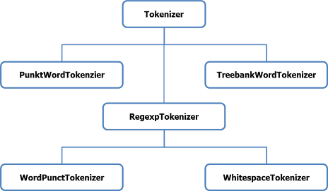

# Chapter 1 字符串操作

## 1.1 Sentences tokenize
- 句子的切分：

```python
import nltk
from nltk.tokenize import sent_tokenize
text =" Welcome readers. I hope you find it interesting. Please do reply."
print(sent_tokenize(text))
```

output:
```
[' Welcome readers.', 'I hope you find it interesting.', 'Please do reply.']
```
<br>
 另一种方法：

```python
import nltk
tokenizer = nltk.data.load('tokenizers/punkt/english.pickle')
text = " Hello everyone. Hope all are fine and doing well. Hope you find the book interesting"
print(tokenizer.tokenize(text))
```
output:
```
[' Hello everyone.', 'Hope all are fine and doing well.', 'Hope you find the book interesting']
```
---
## 1.2 利用不同的pickle进行不同语言的句子切分
例如法语的句子切分：
```python
import nltk
french_tokenizer=nltk.data.load('tokenizers/punkt/french.pickle')
print(french_tokenizer.tokenize('Deux agressions en quelques jours, voilà ce qui a motivé hier matin le débrayage  Levallois. L’équipe pédagogique de ce collège de 750 élèves avait déjà été choquée par l’agression, mercredi , d’un professeur d’histoire'))
```
output
```
['Deux agressions en quelques jours, voilà ce qui a motivé hier matin le débrayage  Levallois.', 'L’équipe pédagogique de ce collège de 750 élèves avait déjà été choquée par l’agression, mercredi , d’un professeur d’histoire']
```
---
## 1.3 Terms tokenize



* 分词

```python
import nltk
terms = nltk.word_tokenize("PierreVinken , 59 years old , will join as a nonexecutive director on Nov. 29 .")
print(terms)
```
output:
```
['PierreVinken', ',', '59', 'years', 'old', ',', 'will', 'join', 'as', 'a', 'nonexecutive', 'director', 'on', 'Nov.', '29', '.']
```

<br>
* 使用指定分词器

```python

```
